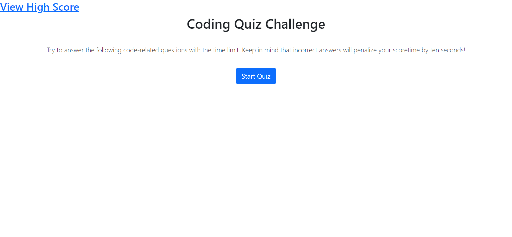
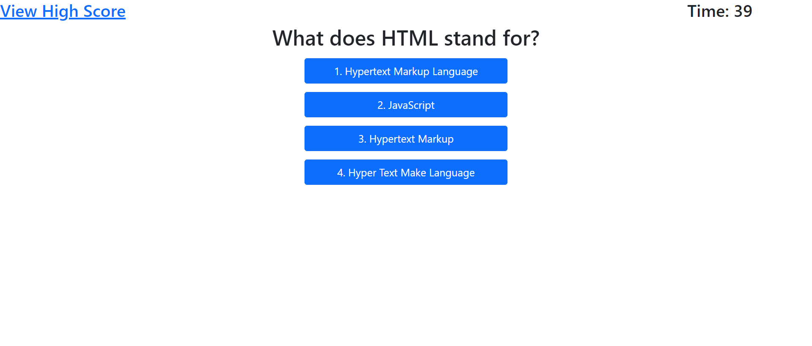
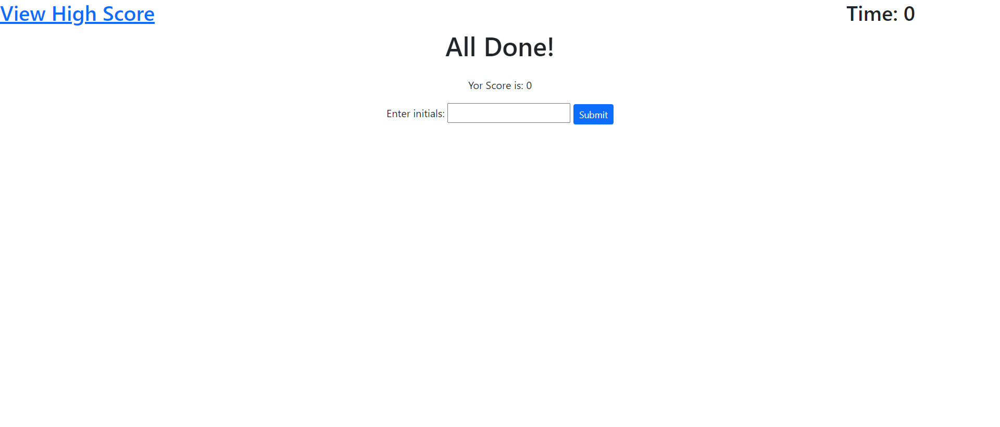
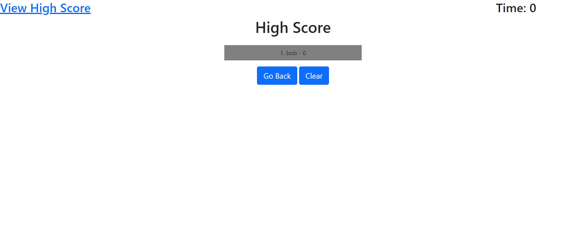

# 04-02-challenge

## Description

This is a JavaScript Quiz game that uses JavaScript / css / HTML
Quiz has a questionaire record score and initials and hughscore section

Through the assignment I learned about Web API and how to minipulate the DOM Tree. Creating various functions and varables I minipulated the DOM using Web API.

## Table of Contents (Optional)

- [Installation](#installation)
- [Usage](#usage)
- [Credits](#credits)
- [License](#license)

## Installation

clone the repository from <https://github.com/JaberSE09/04-02-challenge.git> by running the git clone <https://github.com/JaberSE09/04-02-challenge.git> to the folder of your choice
Then run the index.html file

## Usage

Running the file through <https://jaberse09.github.io/04-02-challenge/ deminstrates how it looks. This Quiz goes through the basics of JavaScript.

    ```md
    
    ```

 ```md
    
    ```
    
     ```md
    
    ```
     ```md
    
    ```
 
 The clear clears the highscore and go back sends you back to the start


## Credits

Sajid Jaber

## License

Copyright (c) [2022] [Sajid Jaber]

Permission is hereby granted, free of charge, to any person obtaining a copy
of this software and associated documentation files (the "Software"), to deal
in the Software without restriction, including without limitation the rights
to use, copy, modify, merge, publish, distribute, sublicense, and/or sell
copies of the Software, and to permit persons to whom the Software is
furnished to do so, subject to the following conditions:

The above copyright notice and this permission notice shall be included in all
copies or substantial portions of the Software.

THE SOFTWARE IS PROVIDED "AS IS", WITHOUT WARRANTY OF ANY KIND, EXPRESS OR
IMPLIED, INCLUDING BUT NOT LIMITED TO THE WARRANTIES OF MERCHANTABILITY,
FITNESS FOR A PARTICULAR PURPOSE AND NONINFRINGEMENT. IN NO EVENT SHALL THE
AUTHORS OR COPYRIGHT HOLDERS BE LIABLE FOR ANY CLAIM, DAMAGES OR OTHER
LIABILITY, WHETHER IN AN ACTION OF CONTRACT, TORT OR OTHERWISE, ARISING FROM,
OUT OF OR IN CONNECTION WITH THE SOFTWARE OR THE USE OR OTHER DEALINGS IN THE
SOFTWARE.

## Badges


